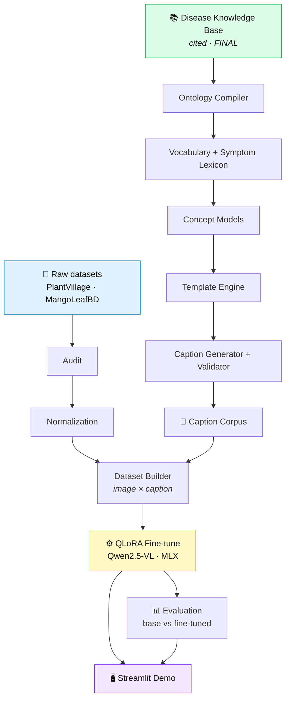
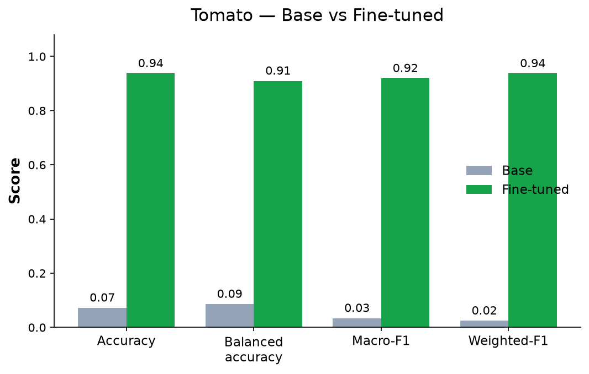
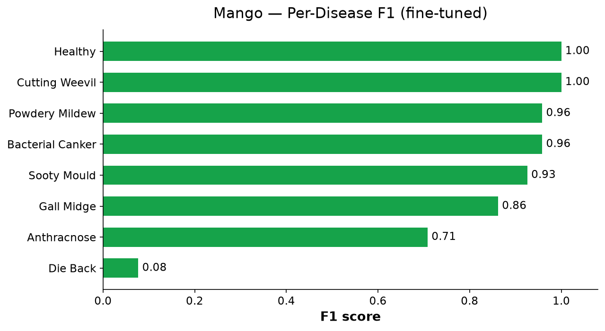
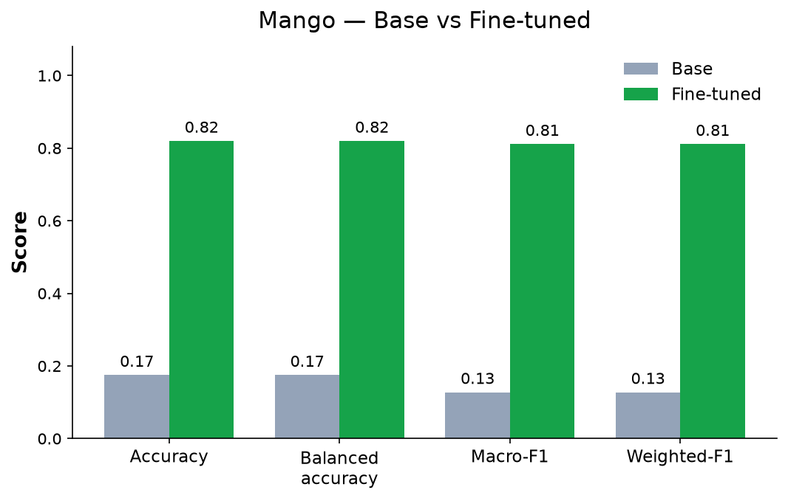

<div align="center">

# 🌿 PlantDx

### Knowledge-grounded Vision–Language models for leaf-disease diagnosis

**A reproducible pipeline that turns a cited disease knowledge base into an instruction-tuning
dataset, QLoRA-fine-tunes Qwen2.5-VL on it, evaluates it, and serves it in an interactive demo —
end to end.**

<br/>

[](LICENSE)
[](pyproject.toml)
[](.github/workflows/ci.yml)
[](pyproject.toml)
[](pyproject.toml)

**Supported today:  🍅 Tomato ✓   ·   🥭 Mango ✓**

<br/>

`Knowledge Base → Ontology → Vocabulary → Prompt generation → QLoRA → Evaluation → Streamlit demo`

</div>

---

## Overview

General-purpose open-weight VLMs are unreliable at zero-shot crop-disease diagnosis — on the base
model here, just **7.3%** accuracy on tomato and **17.5%** on mango. Distilling captions *from* such
models would bake their mistakes into the students.

PlantDx removes models from the caption path entirely. A curated, **cited** Disease Knowledge Base is
compiled — deterministically — into a typed ontology, a controlled vocabulary, per-disease concept
models, and finally a validated instruction-tuning caption corpus. That corpus supervises **QLoRA**
fine-tuning of **Qwen2.5-VL-7B** on Apple Silicon (MLX). Every caption traces to a cited source,
nothing on the generation path calls an LLM/VLM or reads pixels, and the dataset rebuilds
byte-for-byte from `(knowledge base, ontology, seed)`.

## Architecture



Each stage is a `plantdx <stage>` CLI subcommand — deterministic, content-hashed, and independently
tested. Full detail in [`docs/ARCHITECTURE.md`](docs/ARCHITECTURE.md).

## Supported crops

Both crops are first-class: same model, same LoRA recipe, same evaluation.

| Crop | Classes | Images | Test split | Raw dataset | Adapter |
|------|--------:|-------:|-----------:|-------------|---------|
| 🍅 **Tomato** | 10 | 18,006 | 910 | PlantVillage (tomato subset) | `checkpoints/qwen25vl_tomato_qlora` |
| 🥭 **Mango** | 8 | 4,000 | 200 | MangoLeafBD | `checkpoints/qwen25vl_mango_qlora` |

<details>
<summary><b>Class lists</b></summary>

- **Tomato** — healthy · bacterial spot · early blight · late blight · leaf mold · septoria leaf spot · spider mites · target spot · mosaic virus · yellow leaf curl virus
- **Mango** — healthy · anthracnose · bacterial canker · cutting weevil · die back · gall midge · powdery mildew · sooty mould

</details>

## Results

Fine-tuned QLoRA adapters vs. the base **Qwen2.5-VL-7B** on each crop's **frozen, image-grouped,
held-out test split** (PlantVillage-style single-leaf images; no leaf leaks between train and test).
All numbers are read directly from the generated `reports/<run>/evaluation/metrics.json` — not
hand-entered.

**Classification**

| Dataset | Base accuracy | Fine-tuned accuracy | Macro-F1 | Weighted-F1 |
|---------|:-------------:|:-------------------:|:--------:|:-----------:|
| 🍅 Tomato (n=910) | 7.3% | **93.7%** | **0.919** | **0.937** |
| 🥭 Mango (n=200) | 17.5% | **82.0%** | **0.811** | **0.811** |

**Caption quality** (base → fine-tuned)

| Dataset | BLEU-4 | ROUGE-L | METEOR | CIDEr | BERTScore-F1 |
|---------|:------:|:-------:|:------:|:-----:|:------------:|
| 🍅 Tomato | 0.003 → **0.192** | 0.093 → **0.428** | 0.149 → **0.431** | 0.000 → **0.956** | 0.843 → **0.907** |
| 🥭 Mango | 0.004 → **0.190** | 0.098 → **0.423** | 0.160 → **0.454** | 0.000 → **0.946** | 0.843 → **0.907** |

Metrics use official reference implementations (BLEU/CIDEr via `pycocoevalcap`, ROUGE-L via
`rouge-score`, METEOR via `nltk`, BERTScore via `bert-score`). Per-disease breakdowns, statistical
significance, hallucination and clinical-correctness checks, and every figure are written under
`reports/<run>/evaluation/`.

> These are **in-distribution** scores. Casual field/phone photos differ from the PlantVillage
> training data and score lower — the demo surfaces that honestly with low-confidence / unknown
> states rather than asserting a confident wrong answer.

---

### 🍅 Tomato evaluation

<p align="center">
  <br/><br/>
  <br/><br/>
  
</p>

<details>
<summary><b>Per-class results (fine-tuned)</b></summary>

| Disease | Samples | Accuracy | F1 |
|---------|--------:|:--------:|:--:|
| Yellow Leaf Curl Virus | 269 | 99.3% | 0.994 |
| Late Blight | 89 | 98.9% | 0.921 |
| Bacterial Spot | 107 | 97.2% | 0.945 |
| Healthy | 80 | 96.2% | 0.963 |
| Mosaic Virus | 20 | 95.0% | 0.974 |
| Septoria Leaf Spot | 90 | 94.4% | 0.924 |
| Spider Mites | 85 | 90.6% | 0.917 |
| Leaf Mold | 49 | 87.8% | 0.925 |
| Target Spot | 71 | 84.5% | 0.845 |
| Early Blight | 50 | 66.0% | 0.786 |

</details>

### 🥭 Mango evaluation

<p align="center">
  <br/><br/>
  <br/><br/>
  
</p>

<details>
<summary><b>Per-class results (fine-tuned)</b></summary>

| Disease | Samples | Accuracy | F1 |
|---------|--------:|:--------:|:--:|
| Cutting Weevil | 25 | 100.0% | 1.000 |
| Healthy | 25 | 100.0% | 1.000 |
| Sooty Mould | 25 | 100.0% | 0.926 |
| Gall Midge | 25 | 100.0% | 0.862 |
| Bacterial Canker | 25 | 92.0% | 0.958 |
| Powdery Mildew | 25 | 92.0% | 0.958 |
| Anthracnose | 25 | 68.0% | 0.708 |
| Die Back | 25 | 4.0% | 0.077 |

Die Back is the model's weakest class — its symptoms overlap heavily with other conditions on a
single leaf, and it is the hardest to distinguish from a caption alone.

</details>

---

## Streamlit demo

Upload leaf images and get a grounded diagnosis with a real confidence, adapter verification, and the
held-out evaluation results — all in-app.


```bash
# Use the interpreter that has a working mlx-vlm stack (absolute path is safest):
~/miniforge3/envs/vlm/bin/python -m streamlit run streamlit_app.py
```

<!-- Optional: drop a short screen capture at docs/images/demo.gif and it renders here. -->

Confidence is the mean probability of the model's *own* generated tokens; predictions below a
tunable threshold, or that name no known disease, are shown as **low-confidence** / **unknown**
instead of a confident guess. Details: [`docs/DEMO_APP.md`](docs/DEMO_APP.md).

## Performance

Measured on the reference machine (Apple M-series, 24 GB unified memory, MLX):

| | Measured |
|---|---|
| Model + adapter load | ~3 s (once per crop, cached for the session) |
| Inference latency | ~0.8–1.7 s / image (warm, greedy decoding) |
| Active memory | ~5.8 GB, flat across many predictions (MLX cache bounded + cleared per run) |
| Trainable LoRA params | 40,370,176 (rank 16) |

The base model, processor, and adapter load **exactly once** via `st.cache_resource` (one crop
resident at a time); predictions reuse the warm model — nothing reloads per click.

## Repository structure

```
src/plantdx/       the Python package — one subpackage per pipeline stage
app/               the Streamlit demo (presentation layer over the trained adapters)
knowledge_base/    Stage 1 — the cited Disease Knowledge Base (FINAL)
caption_framework/ Stage 2 — caption-generation design spec (FINAL, no code)
ontology_design/   Stage 3 — domain-ontology design spec (FINAL, no code)
configs/           pipeline + per-crop training configuration (YAML)
assets/            authored inputs (templates, label map, instruction banks)
tests/             unit / integration / benchmark (mirrors src/ + app/)
docs/              developer docs, ADRs, and evaluation figures
scripts/           thin CLI wrappers + the README figure renderer
```

Generated outputs (`artifacts/`, `datasets/`, `reports/`, `checkpoints/`, `logs/`, `uploads/`,
`predictions/`) are gitignored and fully regenerable.

## Installation

Requires **Python 3.10+**; training and inference require **Apple Silicon** with MLX.

```bash
git clone git@github.com:iAakash1/experimentation.git && cd experimentation
python -m venv .venv && source .venv/bin/activate
pip install -e ".[dev]"          # package + lint/type/test tooling
pre-commit install
```

Optional extras: `".[train]"` (mlx-vlm), `".[eval]"` (metrics stack; see `make install-eval`), and
`pip install -r app/requirements.txt` for the demo.

## Usage

<details>
<summary><b>1 · Build the caption dataset</b> (deterministic, CPU-only)</summary>

```bash
plantdx audit                 # inventory the raw datasets
plantdx normalize             # canonical datasets/<crop>/processed/
plantdx ontology              # knowledge base → typed graph
plantdx vocabulary            # controlled vocabulary + symptom lexicon
plantdx concepts              # per-disease concept models
plantdx generate              # the validated caption corpus
plantdx corpus --all          # export to generic/llava/paligemma/blip2/messages
```
</details>

<details>
<summary><b>2 · Train</b> (QLoRA on Qwen2.5-VL, MLX — Apple Silicon)</summary>

```bash
plantdx train --config configs/train/qwen25vl_tomato.yaml --dry-run   # preview
plantdx train --config configs/train/qwen25vl_tomato.yaml             # the real run
plantdx train --config configs/train/qwen25vl_mango.yaml  --crop mango
```
See [`docs/TRAINING.md`](docs/TRAINING.md).
</details>

<details>
<summary><b>3 · Evaluate</b> (base vs. fine-tuned)</summary>

```bash
plantdx evaluate --stage all \
    --adapter checkpoints/qwen25vl_tomato_qlora \
    --dataset artifacts/training/qwen25vl_tomato_qlora/dataset
```
Crop is read from the dataset manifest; reports land in `reports/<run>/evaluation/`.
See [`docs/EVALUATION.md`](docs/EVALUATION.md).
</details>

## Why the captions are trustworthy

Seven invariants are enforced *by construction*
([`caption_framework/README.md`](caption_framework/README.md)):

1. **Label-only grounding** — describe the labeled class, never a pixel guess.
2. **Single source of truth** — every fact traces to a cited knowledge-base entry.
3. **Closed vocabulary** — no free-form term can enter a caption.
4. **Observability** — only what's visible on a single leaf may be asserted.
5. **Register integrity** — a mite isn't given a "lesion", a mould isn't "necrosis".
6. **Severity honesty** — no per-image severity claim (the source data has none).
7. **Reproducibility** — fully seeded, content-hashed, byte-for-byte rebuildable.

## Roadmap

| Milestone | Status |
|-----------|:------:|
| Audit · Normalization · Ontology · Vocabulary compilers | ✅ |
| Concept models · Template engine · Caption corpus · Exporters | ✅ |
| QLoRA training (Qwen2.5-VL, tomato + mango) | ✅ |
| Evaluation (base vs. fine-tuned, crop-agnostic) | ✅ |
| Streamlit demo | ✅ |
| Image-grounded Instruction Dataset Builder + the other three VLM converters | ⏳ |

Detailed plan: [`docs/ROADMAP.md`](docs/ROADMAP.md).

## Contributing

Contributions welcome — see [`CONTRIBUTING.md`](CONTRIBUTING.md), the
[developer guide](docs/DEVELOPMENT.md), and [`CODE_OF_CONDUCT.md`](CODE_OF_CONDUCT.md). All changes
must preserve the seven invariants and pass `ruff` / `ruff format --check` / `mypy` / `pytest`.

## Citation

```bibtex
@software{plantdx2026,
  title  = {PlantDx: A Knowledge-Grounded Framework for Instruction-Tuning
            Datasets for Agricultural Vision-Language Models},
  author = {PlantDx Contributors},
  year   = {2026},
  url    = {https://github.com/iAakash1/experimentation}
}
```

See [`CITATION.cff`](CITATION.cff) for machine-readable metadata.

## License

**Apache License 2.0** — see [`LICENSE`](LICENSE). Dataset licenses (PlantVillage, MangoLeafBD) are
retained by their original authors and are **not** redistributed here.
