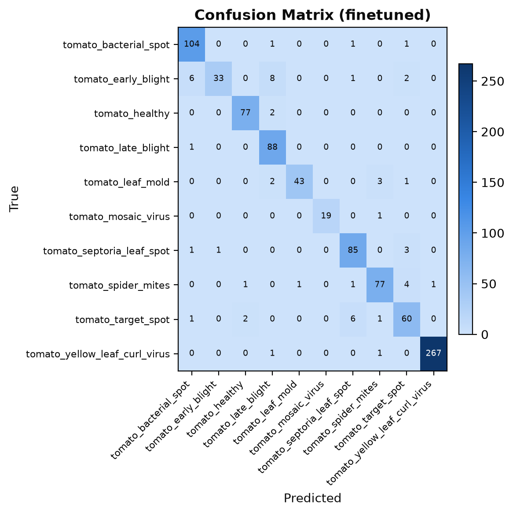
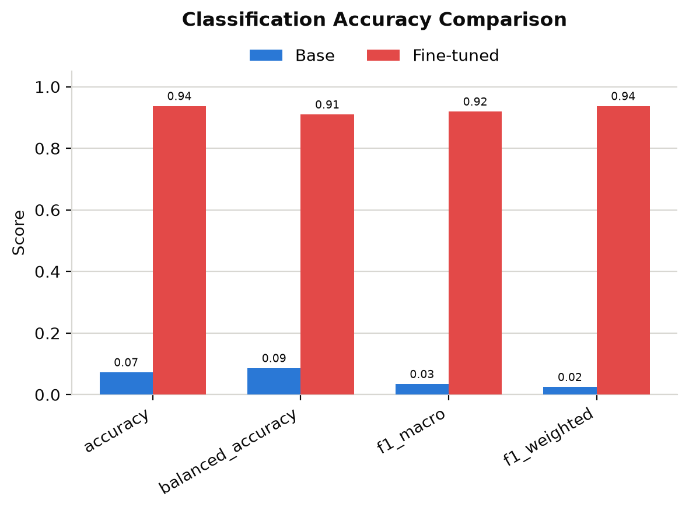
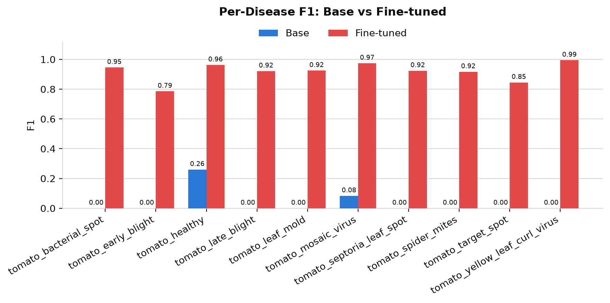
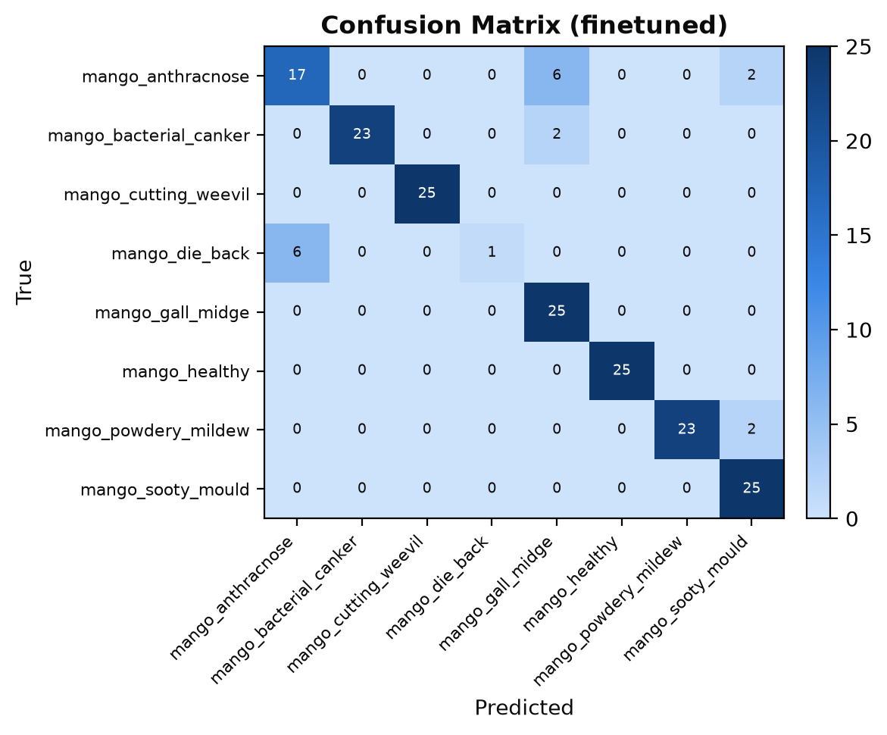

<div align="center">

# 🌿 PlantDx

**A knowledge-grounded framework for building instruction-tuning datasets and fine-tuning agricultural Vision–Language Models — end to end, and reproducibly.**

[](LICENSE)
[](pyproject.toml)
[](.github/workflows/ci.yml)
[](pyproject.toml)
[](pyproject.toml)

Deterministic caption dataset → QLoRA fine-tuning (MLX) → evaluation → interactive demo, for **tomato** and **mango** leaf disease.

</div>

---

## Overview

General-purpose open-weight VLMs are unreliable at zero-shot crop-disease diagnosis
(measured on the base model here: **7.3%** accuracy on tomato, **17.5%** on mango).
Distilling captions *from* such models would bake their errors into the students.

**PlantDx removes models from the caption path entirely.** A curated, cited
**Disease Knowledge Base (DKB)** is compiled — deterministically — into a typed
ontology, a controlled vocabulary, per-disease concept models, and finally a
diverse instruction-tuning caption corpus. That corpus supervises **QLoRA**
fine-tuning of **Qwen2.5-VL-7B** on Apple Silicon (MLX), and a two-stage
evaluation compares the fine-tuned adapters against the base model on a frozen,
image-grouped test split.

Every caption is traceable, by construction, to a cited source; nothing on the
generation path calls an LLM/VLM or reads image pixels; and the whole dataset
rebuilds byte-for-byte from `(DKB, ontology, seed)` — a property no
LLM/VLM-generated corpus can offer.

## Features

- **Deterministic, cited caption pipeline** — DKB → ontology → vocabulary →
  concept models → templates → validated corpus, each stage a pure, content-hashed function.
- **Fail-closed validation** at every stage (`V-ONT-*`, `V-VOC-*`, `V-CON-*`, `V-TPL-*`, `V-CAP-*`).
- **QLoRA fine-tuning** of Qwen2.5-VL-7B-Instruct-4bit via `mlx-vlm` (Apple M-series), config-driven per crop.
- **Two-stage evaluation** (`inference` | `analyze`) with official reference metrics
  (BLEU / ROUGE-L / METEOR / CIDEr / BERTScore) + full classification metrics, DKB-grounded
  hallucination & clinical-correctness checks, and publication-quality figures.
- **Crop-agnostic** — crop is read from the dataset manifest, never hardcoded; adding a crop needs no code change.
- **Interactive Streamlit demo** — upload a leaf, get a grounded diagnosis with a real
  confidence, adapter verification, and the held-out evaluation results in-app.
- **Reproducible & typed** — `ruff`, `mypy --strict`, `pytest`; golden content-hash
  regression tests; deterministic seed fan-out.

## Results

Fine-tuned QLoRA adapters vs. the base Qwen2.5-VL-7B on each crop's **frozen,
held-out test split** (PlantVillage-style single-leaf images; image-grouped so no
leaf leaks between train and test). Numbers are read directly from the generated
`reports/<run>/evaluation/metrics.json` — not hand-entered.

| Crop | Split | Metric | Base | Fine-tuned |
|------|-------|--------|-----:|-----------:|
| **Tomato** | 910 img | Accuracy | 7.3% | **93.7%** |
| | | Macro-F1 | 0.034 | **0.919** |
| | | BLEU-4 / ROUGE-L / METEOR | 0.003 / 0.093 / 0.149 | **0.192 / 0.428 / 0.431** |
| | | CIDEr / BERTScore-F1 | 0.000 / 0.843 | **0.956 / 0.907** |
| **Mango** | 200 img | Accuracy | 17.5% | **82.0%** |
| | | Macro-F1 | 0.128 | **0.811** |
| | | BLEU-4 / ROUGE-L / METEOR | 0.004 / 0.098 / 0.160 | **0.190 / 0.423 / 0.454** |
| | | CIDEr / BERTScore-F1 | 0.000 / 0.843 | **0.946 / 0.907** |

<div align="center">

| Tomato — confusion matrix (fine-tuned) | Tomato — accuracy vs. base |
|:--:|:--:|
|  |  |

| Tomato — per-disease F1 | Mango — confusion matrix (fine-tuned) |
|:--:|:--:|
|  |  |

</div>

> These are **in-distribution** scores. Casual field/phone photos differ from the
> PlantVillage training data and score lower; the demo surfaces that honestly with
> low-confidence / unknown states rather than asserting a confident wrong answer.
> Full metrics, per-disease tables, statistical significance, and all figures live
> under `reports/<run>/evaluation/` after you run `plantdx evaluate`.

## Architecture

```
Disease Knowledge Base (FINAL, cited)                 raw datasets (immutable)
        │                                             tomato/ · mango/
        ▼                                                     │
 Domain Ontology Compiler  ──►  typed knowledge graph         ▼
        │                       (content-hashed)      Audit ─► Normalization
        ▼                                                     │  datasets/<crop>/processed/
 Vocabulary + Symptom Lexicon Compiler                        │
        │                                                     │
        ▼                                                     │
 Concept Models ─► Template Engine ─► Planner ─► Generator ─► Validator ─► Corpus
        │                                                                    │
        │                       (image paths + folder labels only)          ▼
        └──────────────►  Training data builder  ◄───────── frozen caption corpus
                                    │  (image × caption → mlx-vlm JSONL)
                                    ▼
                         QLoRA fine-tune (Qwen2.5-VL, MLX)  ─►  Evaluation  ─►  Streamlit demo
```

Each stage is a CLI subcommand (`plantdx <stage>`), deterministic, and independently
tested. See [`docs/ARCHITECTURE.md`](docs/ARCHITECTURE.md).

## Supported crops

| Crop | Classes | Raw dataset | Adapter |
|------|--------:|-------------|---------|
| 🍅 Tomato | 10 | PlantVillage (tomato subset) | `checkpoints/qwen25vl_tomato_qlora` |
| 🥭 Mango | 8 | MangoLeafBD | `checkpoints/qwen25vl_mango_qlora` |

Adding a crop is additive: author a DKB entry + a `configs/train/qwen25vl_<crop>.yaml`,
then run the same pipeline — no code change (crop is derived from the dataset manifest).

## Repository structure

```
src/plantdx/            the Python package (audit, normalization, ontology, vocabulary,
                        concepts, templates, corpus, exporters, training, evaluation)
app/                    the Streamlit demo (presentation layer over the trained adapters)
streamlit_app.py        demo entry point
knowledge_base/         Stage 1 — the Disease Knowledge Base (FINAL, cited)
caption_framework/      Stage 2 — caption-generation design spec (FINAL, no code)
ontology_design/        Stage 3 — domain-ontology design spec (FINAL, no code)
configs/                pipeline + training configuration (YAML)
assets/                 authored inputs (templates, label map, instruction banks)
tests/                  unit / integration / benchmark (mirrors src/ + app/)
docs/                   developer docs (per-stage usage, ADRs, figures)
```

Generated outputs (`artifacts/`, `datasets/`, `reports/`, `checkpoints/`, `logs/`,
`uploads/`, `predictions/`) are gitignored and fully regenerable.

## Installation

Requires **Python 3.10+**. Training and inference require **Apple Silicon** with MLX.

```bash
git clone git@github.com:iAakash1/experimentation.git && cd experimentation
python -m venv .venv && source .venv/bin/activate
pip install -e ".[dev]"          # package + lint/type/test tooling
pre-commit install
```

Optional extras: `".[train]"` (mlx-vlm, Apple Silicon), `".[eval]"` (metrics stack;
see `make install-eval`), plus `pip install -r app/requirements.txt` for the demo.

## Usage

### Build the caption dataset (deterministic, CPU-only)

```bash
plantdx audit                 # inventory the raw datasets
plantdx normalize             # canonical datasets/<crop>/processed/
plantdx ontology              # DKB → typed knowledge graph
plantdx vocabulary            # controlled vocabulary + symptom lexicon
plantdx concepts              # per-disease concept models
plantdx generate              # the validated caption corpus
plantdx corpus --all          # export to generic/llava/paligemma/blip2/messages
```

### Train (QLoRA on Qwen2.5-VL, MLX — Apple Silicon)

```bash
plantdx train --config configs/train/qwen25vl_tomato.yaml --dry-run   # preview plan + command
plantdx train --config configs/train/qwen25vl_tomato.yaml             # the real run
plantdx train --config configs/train/qwen25vl_mango.yaml  --crop mango
```

Same LoRA/optimizer/schedule for both crops; only crop-specific values differ. See
[`docs/TRAINING.md`](docs/TRAINING.md).

### Evaluate (base vs. fine-tuned)

```bash
plantdx evaluate --stage all \
    --adapter checkpoints/qwen25vl_tomato_qlora \
    --dataset artifacts/training/qwen25vl_tomato_qlora/dataset
```

Crop is read from the dataset manifest; reports land in `reports/<run>/evaluation/`.
See [`docs/EVALUATION.md`](docs/EVALUATION.md).

### Demo

```bash
# Use the interpreter that has a working mlx-vlm stack (absolute path is safest):
~/miniforge3/envs/vlm/bin/python -m streamlit run streamlit_app.py
```

Upload leaf images → grounded diagnosis with a real confidence, adapter verification,
and the held-out evaluation results, all in-app. See [`docs/DEMO_APP.md`](docs/DEMO_APP.md).

<!-- Demo recording placeholder: drop a short screen capture at docs/images/demo.gif and it will render here. -->

## Why the captions are trustworthy

Seven invariants are enforced *by construction*, not by review
([`caption_framework/README.md`](caption_framework/README.md)):

1. **Label-only grounding** — captions describe the labeled class, never a pixel guess.
2. **DKB is the single source of truth** — every fact traces to a cited entry.
3. **Closed vocabulary** — no free-form term can enter a caption.
4. **Observability** — only what's visible on a single leaf may be asserted.
5. **Pest/pathogen register integrity** — a mite isn't given a "lesion", etc.
6. **Severity honesty** — no per-image severity claim (the source data has none).
7. **Reproducibility** — fully seeded, content-hashed, byte-for-byte rebuildable.

## Roadmap

| Milestone | Status |
|-----------|:------:|
| Audit · Normalization · Ontology · Vocabulary compilers | ✅ |
| Concept models · Template engine · Caption corpus · Exporters | ✅ |
| QLoRA training (Qwen2.5-VL, tomato + mango) | ✅ |
| Evaluation (base vs. fine-tuned, crop-agnostic) | ✅ |
| Streamlit demo | ✅ |
| Image-grounded Instruction Dataset Builder + the other three VLM converters | ⏳ |

Detailed plan: [`docs/ROADMAP.md`](docs/ROADMAP.md).

## Contributing

Contributions welcome — see [`CONTRIBUTING.md`](CONTRIBUTING.md), the
[developer guide](docs/DEVELOPMENT.md), and [`CODE_OF_CONDUCT.md`](CODE_OF_CONDUCT.md).
All changes must preserve the seven design invariants and pass
`ruff` / `ruff format --check` / `mypy` / `pytest`.

## Citation

```bibtex
@software{plantdx2026,
  title  = {PlantDx: A Knowledge-Grounded Framework for Instruction-Tuning
            Datasets for Agricultural Vision-Language Models},
  author = {PlantDx Contributors},
  year   = {2026},
  url    = {https://github.com/iAakash1/experimentation}
}
```

See [`CITATION.cff`](CITATION.cff) for machine-readable metadata.

## License

**Apache License 2.0** — see [`LICENSE`](LICENSE). Dataset licenses (PlantVillage,
MangoLeafBD) are retained by their original authors and are **not** redistributed here.
